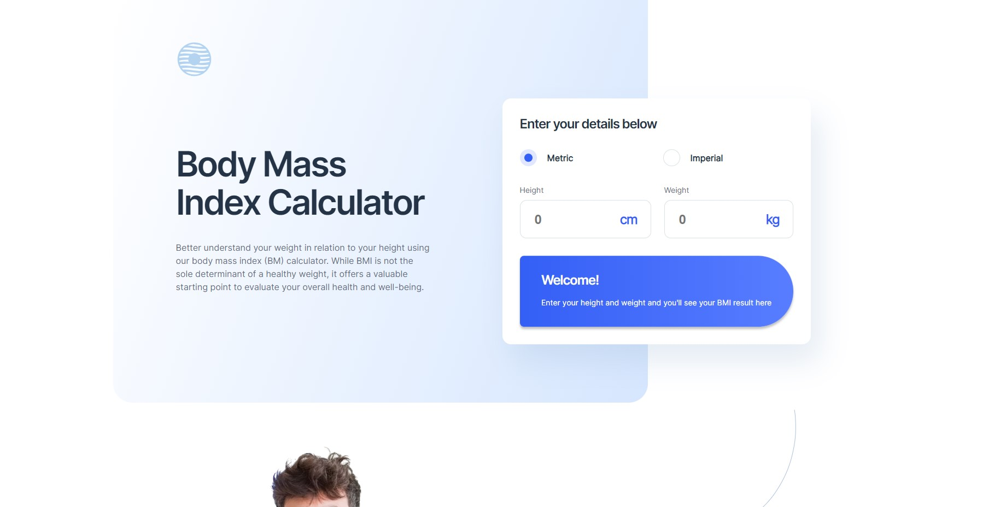

# Frontend Mentor - Body Mass Index Calculator solution

This is a solution to the [Body Mass Index Calculator challenge on Frontend Mentor](https://www.frontendmentor.io/challenges/body-mass-index-calculator-brrBkfSz1T). Frontend Mentor challenges help you improve your coding skills by building realistic projects. 

## Table of contents

- [Overview](#overview)
  - [The challenge](#the-challenge)
  - [Screenshot](#screenshot)
  - [Links](#links)
- [My process](#my-process)
  - [Built with](#built-with)
  - [What I learned](#what-i-learned)
  - [Useful resources](#useful-resources)
- [Author](#author)

## Overview

### The challenge

Users should be able to:

- Select whether they want to use metric or imperial units
- Enter their height and weight
- See their BMI result, with their weight classification and healthy weight range
- View the optimal layout for the interface depending on their device's screen size
- See hover and focus states for all interactive elements on the page

### Screenshot



### Links

- Solution URL: https://github.com/Wojtek-A/bmi-calculator-frontend-mentor
- Live Site URL: https://wojtek-a.github.io/bmi-calculator-frontend-mentor

## My process

### Built with

- Semantic HTML5 markup
- CSS custom properties
- SCSS SASS
- Mobile-first workflow

### What I learned

```js
let text = `<p class="text">My name is ${changeName('Wojtek')}}</p>`
```
Put the function in ${}.
How to convert measurement units.

### Useful resources

- https://stackoverflow.com/ - JS problems.

## Author

- Website - https://github.com/Wojtek-A
- Frontend Mentor - https://www.frontendmentor.io/profile/Wojtek-A

